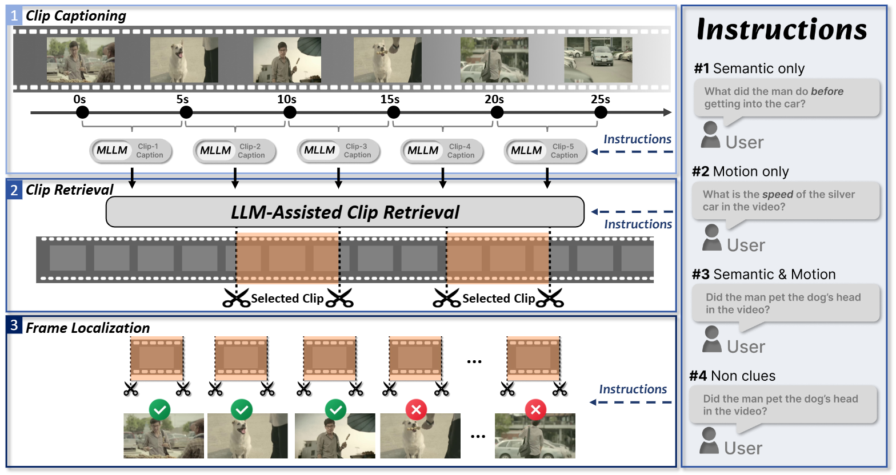
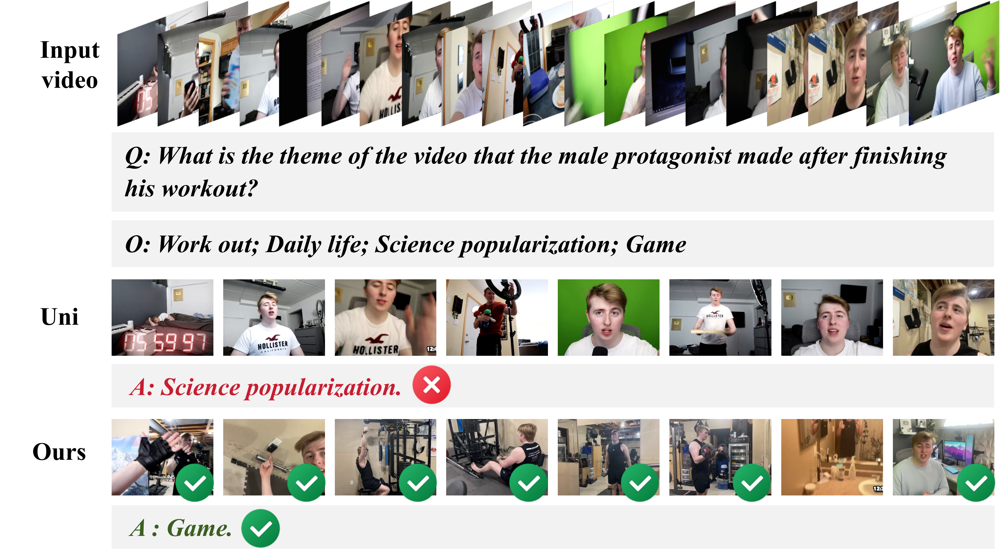
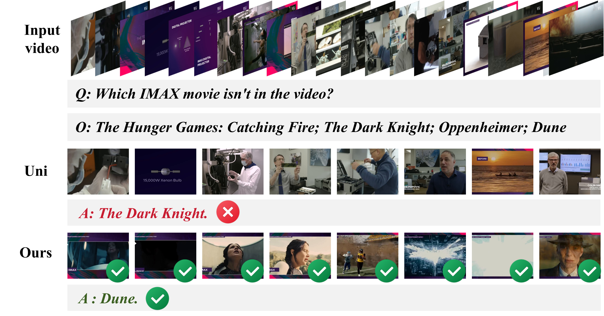

# [CVPR 2026] VideoITG: Multimodal Video Understanding with Instructed Temporal Grounding

---

[](https://github.com/tatsu-lab/stanford_alpaca/blob/main/LICENSE)
[](MODEL_LICENSE)
[](#)


## Introduction

<div align="center">
  <a href="https://arxiv.org/abs/2507.13353">
    
  </a>
  <a href="https://nvlabs.github.io/VideoITG/">
    
  </a>
  <a href="https://huggingface.co/nvidia/VideoITG-8B">
    
  </a>
  <a href="https://huggingface.co/datasets/NVEagle/VideoITG-40K">
    
  </a>
</div>

<div align="center">

</div>

While Video Large Language Models (Video-LLMs) have shown significant potential in multimodal understanding and reasoning tasks, efficiently selecting the most informative frames from videos remains a critical challenge. To address this, we introduce **Instructed Temporal Grounding for Videos (VideoITG)**, a framework that adaptively customizes frame sampling strategies based on user instructions. VideoITG is supported by **VidThinker**, an automated annotation pipeline that (1) generates instruction-conditioned clip captions, (2) retrieves relevant video segments with instruction-guided reasoning, and (3) performs fine-grained frame localization. Using VidThinker, we build the **VideoITG-40K** dataset with **40K videos and 500K temporal grounding annotations**. Our plug-and-play VideoITG model leverages Video-LLMs' visual-language alignment and reasoning for discriminative frame selection, consistently improving performance across multiple multimodal video understanding benchmarks.


## Updates
- [2026/03/17] Release notes: add **CG-Bench (mini)** evaluation support and release **Qwen3-VL** + **InternVL3.5** evaluation scripts under `scripts/eval_lmms_eval/`.
- [2026/02/21] 🎉 **Accepted by CVPR 2026**.
- [2025/09/30] The results of VideoITG on benchmarks release. See [results](results/) for released JSONL files.
- [2025/07/25] Code and checkpoint release. 
- [2025/07/18] Technical report release. [[arXiv](https://arxiv.org/abs/2507.13353)]


## Contents
- [Models & Performance](#models--performance)
- [Visual Examples](#visual-examples)
- [Inference](#inference)
- [Install](#install)
- [Training Data](#training-data)
- [Checkpoint Preparation](#checkpoint-preparation)
- [Training](#training)
- [Evaluation](#evaluation)


## Models & Performance
Results below are copied from the paper (Table 3). `UNI-32` denotes uniform sampling of 32 frames, and `ITG-32` denotes selecting Top-32 frames based on relevance scores produced by VideoITG.

| Video-LLM | Selection | LongVideoBench | MLVU | VideoMME-S | VideoMME-M | VideoMME-L | CG-Bench-mini | Average |
|---|---:|---:|---:|---:|---:|---:|---:|---:|
| InternVL2.5-8B | UNI-32 | 58.3 | 66.4 | 75.1 | 61.7 | 53.1 | 37.7 | 58.7 |
| InternVL2.5-8B | ITG-32 | 61.9 (+3.6) | 75.0 (+8.6) | 78.0 (+2.9) | 67.1 (+5.4) | 56.9 (+3.8) | 46.7 (+9.0) | 64.3 (+5.6) |
| InternVL2.5-26B | UNI-32 | 55.6 | 71.3 | 78.1 | 67.1 | 56.9 | 40.6 | 61.6 |
| InternVL2.5-26B | ITG-32 | 63.0 (+7.4) | 78.9 (+7.6) | 80.8 (+2.7) | 69.0 (+1.9) | 59.9 (+3.0) | 48.7 (+8.1) | 66.7 (+5.1) |
| InternVL3.5-8B | UNI-32 | 60.0 | 70.0 | 77.0 | 62.4 | 53.4 | 40.9 | 60.6 |
| InternVL3.5-8B | ITG-32 | 65.7 (+5.7) | 74.1 (+4.1) | 78.4 (+1.4) | 65.9 (+3.5) | 59.0 (+5.6) | 47.6 (+6.7) | 65.1 (+4.5) |
| Qwen3-VL | UNI-32 | 59.1 | 64.1 | 76.0 | 60.9 | 55.1 | 40.1 | 59.2 |
| Qwen3-VL | ITG-32 | 63.6 (+4.5) | 77.2 (+13.1) | 79.9 (+3.9) | 66.6 (+5.7) | 60.3 (+5.2) | 47.3 (+7.2) | 65.8 (+6.6) |
| LLaVA-Video-7B | UNI-32 | 58.7 | 66.8 | 76.3 | 60.3 | 52.7 | 35.8 | 58.4 |
| LLaVA-Video-7B | ITG-32 | 61.6 (+2.9) | 74.6 (+7.8) | 77.3 (+1.0) | 65.9 (+5.6) | 55.2 (+2.5) | 42.8 (+7.0) | 62.9 (+4.5) |
| Eagle2.5-8B | UNI-32 | 63.0 | 67.8 | 78.8 | 64.1 | 55.9 | 41.2 | 61.8 |
| Eagle2.5-8B | ITG-32 | 66.8 (+3.8) | 76.5 (+8.7) | 80.0 (+1.2) | 67.8 (+3.7) | 60.3 (+4.4) | 49.0 (+7.8) | 66.7 (+4.9) |


## Visual Examples

<div align="center">

</div><br>

<div align="center">

</div><br>


## Inference

### Checkpoint
- **VideoITG checkpoint (Top‑K selector)**: `nvidia/VideoITG-8B` ([HuggingFace](https://huggingface.co/nvidia/VideoITG-8B))

### How frame selection works (512 → sort → Top‑K)
Our VideoITG selector **scores 512 sampled frames** (default in scripts) with a sigmoid head, **sorts frames by score (descending)**, then selects the **Top‑K** most relevant frames. For downstream usage, we typically **sort the selected frame indices in ascending order** (chronological) before feeding them into a Video-LLM.

You can directly refer to the provided inference reference implementation: [`infer.py`](infer.py) (https://github.com/NVlabs/VideoITG/blob/main/infer.py)).

### JSONL outputs explained
There are **two** JSONL files commonly used in this repo:

1) **Grounding output** (`results.jsonl` written by `--model videoitg`)
   - Default path: `${output_dir}/results.jsonl` (see `output_dir` in `scripts/eval_lmms_eval/videomme_grounding.sh`)
   - Each line is a JSON dict containing (key fields):
     - `doc_id`: sample id in the benchmark split
     - `video_path`: video path used by the task loader
     - `contexts`: the full prompt used for scoring
     - `index`: a list of **frame indices ordered by score (descending)** (mapped back to original video frame ids)
     - `logits`: the corresponding **sorted scores** (same order as `index`, rounded to 2 decimals)

   Example (one line):
```json
{"doc_id": 12, "video_path": "...", "index": [120, 60, 180], "logits": [0.98, 0.97, 0.95]}
```

2) **Frame indices file** (`frame_indices_jsonl` consumed by downstream Video-LLMs)
   - Used by models like InternVL / Qwen3-VL / Eagle (see `frame_indices_jsonl` in `scripts/eval_lmms_eval/*.sh`)
   - Format: each line is:
```json
{"doc_id": 12, "index": [60, 120, 180]}
```
   - Here, `index` should be the **selected Top‑K frame indices** for that `doc_id` (usually sorted ascending for chronological order).

## Install
Please following the guide here to prepare the environment on **Linux OS**.
<!-- currently does not support windows and MacOS -->

1. Clone this repository
```bash
git clone https://github.com/NVlabs/VideoITG.git
cd VideoITG
```

2. Create environment and install package
```Shell
conda create -n videoitg python=3.12 -y
conda activate videoitg
pip install --upgrade pip  # enable PEP 660 support
pip install -r requirements.txt
```

3. Install additional packages for training cases
```bash
pip install flash-attn==2.4.2 --no-build-isolation
```

## Training Data

### VideoLLM Data
For VideoLLM training, we use the same data and strategy as LLaVA-Video, including the [Pretraining Data](https://huggingface.co/datasets/liuhaotian/LLaVA-CC3M-Pretrain-595K), [OV SFT Data](https://huggingface.co/datasets/lmms-lab/LLaVA-OneVision-Data) and [LLaVA-Video Data](https://huggingface.co/datasets/lmms-lab/LLaVA-Video-178K).


### VideoITG Data


## Checkpoint Preparation
We recommend using the VideoLLM checkpoints we provided [here](https://huggingface.co/exiawsh/eagle-qwen2-7b-finetune-uni-ov-video-finetune-sftv1) to reproduce our results.

## Training
You can train the model following:

```bash
bash scripts/videoitg/finetune-uni-64frame-qwen2-7b-grounding.sh finetune 16
```

In default we use 128 NVIDIA A100 80G GPU to conduct the training. Please modify the `per_device_train_batch_size` and `gradient_accumulation_steps` if you are using different amount of GPUs. The training for VideoITG requires 4 hours.

### Notes
If you have limited GPU resources or memory, please considering the following:

- use gradient accumulation and reduce the per-device batch size

## Evaluation

### Evaluation with LMMs-Eval
For evaluation, we use Videomme as an example.
First, using this command to run our VideoITG model and get the instructed grounding results.

```bash
bash scripts/eval_lmms_eval/videomme_grounding.sh
```

After running this command, a .jsonl file containing the scores for each frame will be generated in the output directory output_dir=./videomme_result_512. We will select $K$ frames from these files to be used for inference with the downstream VLM.

Taking the InternVL2.5 model as an example, run the following command:
```bash
bash scripts/eval_lmms_eval/internvl2.5.sh
```
Before running the script, you first need to fill in the path of the .jsonl file generated in the output_dir into the frame_indices_jsonl variable. Then, set num_frame according to your specific needs; for instance, if you want to select the top 32 frames, set num_frame to 32 in the script.

#### Script arguments explained
All evaluation scripts are thin wrappers around `lmms_eval` with `accelerate`. The key arguments are:

- `--tasks`: which benchmark to run (e.g., `videomme`, `mlvu`, `longvideobench_val_v`, `cgbench_subtitles`).
- `--model`: the evaluation backend (e.g., `videoitg`, `internvl2`, `internvl3_5`, `qwen3_vl`, `eagle2_5`).
- `--model_args`: comma-separated key-value pairs consumed by each `--model`.
  - **VideoITG grounding stage** (`--model videoitg`, see `videomme_grounding.sh`):
    - `pretrained`: HF repo or local path of VideoITG (default: `nvidia/VideoITG-8B`).
    - `num_frames`: number of uniformly decoded frames to score before selection (e.g., `512`).
    - `target_fps`: target fps used when extracting frames (e.g., `1`).
    - `output_dir`: where the per-sample frame scores `.jsonl` are written (e.g., `./videomme_result_512`).
  - **Downstream Video-LLM stage** (e.g., `internvl2.5.sh`, `internvl3.5.sh`, `qwen3_vl.sh`):
    - `pretrained`: HF repo of the downstream Video-LLM.
    - `frame_indices_jsonl`: the selected frame indices file (Top-K indices per sample), produced from the grounding stage output.
    - `num_frame` / `max_num_frames`: how many frames to feed into the downstream model (typically `32`).
    - `modality`: set to `video` for models that require it (e.g., InternVL / Eagle).
### Notes
In our paper, we report the results of CG-Bench mini, which includes 3,000 QA pairs.

If you want to evaluate Eagle2.5, please update transformers to 4.55.4 (but can't infer our VideoITG Model).

## Citation
If you find this project useful, please cite our work:
```
@misc{wang2025videoitgmultimodalvideounderstanding,
  title        = {VideoITG: Multimodal Video Understanding with Instructed Temporal Grounding},
  author       = {Shihao Wang and Guo Chen and De-an Huang and Zhiqi Li and Minghan Li and Guilin Liu and Jose M. Alvarez and Lei Zhang and Zhiding Yu},
  year         = {2025},
  eprint       = {2507.13353},
  archivePrefix= {arXiv},
  primaryClass = {cs.CV},
  url          = {https://arxiv.org/abs/2507.13353}
}
```
## License/Terms of Use
- The code is released under the [Apache 2.0 License](https://github.com/NVlabs/VideoITG/blob/main/LICENSE).
- Portions of the code under lmms-eval are reused and subject to their original [licenses](https://github.com/NVlabs/VideoITG/blob/main/lmms_eval/LICENSE). Some files have been modified, with appropriate attribution and additional license headers added where applicable.
- The pretrained model weights are released under the [NVIDIA License](https://github.com/NVlabs/VideoITG/blob/main/LICENSE_Model). The model is a research preview intended for non-commercial use only, and is subject to the following licenses and terms:
  - Model License of Qwen2-7B-Instruct: [Apache 2.0](https://huggingface.co/Qwen/Qwen2-7B-Instruct/blob/main/LICENSE).
  - Model License of SigLIP: [Apache 2.0](https://huggingface.co/google/siglip-so400m-patch14-384).
- For code contributions to VideoITG, please refer to the [Contribution Guide](https://github.com/NVlabs/VideoITG/blob/main/CONTRIBUTING.md).
- Users are reminded to ensure that their use of the dataset and model weights is in compliance with all applicable laws and regulations.

## Acknowledgement
- [Eagle](https://github.com/NVlabs/EAGLE): the codebase we built upon.
- [LMMs-Eval](https://github.com/EvolvingLMMs-Lab/lmms-eval): many thanks to the LMMs-Lab for the easy-to-use evaluation tools.
- [LLaVA-OneVision](https://huggingface.co/datasets/lmms-lab/LLaVA-OneVision-Data) and [LLaVA-Video](https://huggingface.co/datasets/lmms-lab/LLaVA-Video-178K): we train our models with the data from these great open-source projects.
