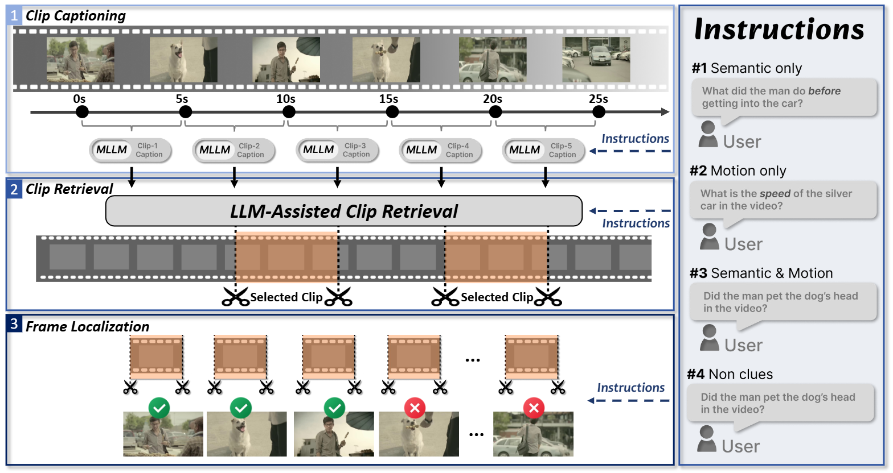

# VideoITG: Multimodal Video Understanding with Instructed Temporal Grounding

---

[](https://github.com/tatsu-lab/stanford_alpaca/blob/main/LICENSE)
[](MODEL_LICENSE)


## Introduction

<div align="center">
  <a href="https://arxiv.org/abs/2507.13353">
    
  </a>
  <a href="https://nvlabs.github.io/VideoITG/">
    
  </a>
  <a href="https://huggingface.co/datasets/NVEagle/VideoITG-40K">
    
  </a>
</div>

<div align="center">

</div>

VideoITG is an innovative approach to video understanding, designed to enhance the performance of Video Large Language Models (Video-LLMs) through informed frame selection. It tackles the complexities of real-world video scenarios by aligning frame sampling with user instructions. VideoITG employs a comprehensive pipeline that includes detailed clip-level description generation, question-guided clip retrieval, and task-specific frame selection. This results in a robust dataset of 40K videos and 480K annotations. The plug-and-play model leverages visual language alignment and reasoning, achieving superior results across multimodal benchmarks, particularly in tasks requiring precise temporal grounding.


## Updates
- [2025/09/30] The results of VideoITG on benchmarks release. See [results](results/) for released JSONL files.
- [2025/07/25] Code and checkpoint release. 
- [2025/07/18] Technical report release. [[arXiv](https://arxiv.org/abs/2507.13353)]


## Contents
- [Models & Performance](#models--performance)
- [Visual Examples](#visual-examples)
- [Install](#install)
- [Training Data](#training-data)
- [Checkpoint Preparation](#checkpoint-preparation)
- [Training](#training)
- [Evaluation](#evaluation)


## Models & Performance
Here is the model trained on our organized 1.8M supervised fine-tuning data.
| Model&nbsp;&nbsp;&nbsp;&nbsp;&nbsp;&nbsp;&nbsp;&nbsp;&nbsp;&nbsp;&nbsp;&nbsp;&nbsp; | VideoLLM&nbsp;&nbsp;&nbsp;&nbsp;&nbsp;&nbsp;&nbsp;&nbsp;&nbsp;&nbsp;&nbsp;&nbsp;&nbsp; | Frames | LongVideoBench | MLVU | VideoMME | CG-Bench |
|----------|------------|-------------|:------:|:-------:|:----------:|:----------:|
| VideoITG-7B | InternVL2.5-8B  | 32 | 61.9 (+2.9%) | 75.0 (+7.8%) |  67.3 (+4.0%)  |    46.7 (+7.0%)    |
| VideoITG-7B | InternVL2.5-26B | 32 | 63.0 (+1.0%) | 78.9 (+6.1%) |  69.9 (+2.5)  |   48.7 (+6.0%)    |
| VideoITG-7B | LLaVA-Video-7B  | 32 | 61.6 (3.6%) | 74.6 (+8.6%) |  66.1 (+3.0%)  |      42.8 (+9.0%)     |
| VideoITG-7B | LLaVA-Video-7B  | 64 | 60.9 (+7.4%) | 76.3 (+7.6%) |  66.4 (+1.9%)  |    42.9 (8.1%)   |


## Visual Examples

<div align="center">

</div><br>

<div align="center">

</div><br>


## Install
Please following the guide here to prepare the environment on **Linux OS**.
<!-- currently does not support windows and MacOS -->

1. Clone this repository
```bash
git clone https://github.com/NVlabs/VideoITG.git
cd VideoITG
```

2. Create environment and install package
```Shell
conda create -n videoitg python=3.12 -y
conda activate videoitg
pip install --upgrade pip  # enable PEP 660 support
pip install -r requirements.txt
```

3. Install additional packages for training cases
```bash
pip install flash-attn==2.4.2 --no-build-isolation
```

## Training Data

### VideoLLM Data
For VideoLLM training, wew use the same data and stragety as LLaVA-Video, including the [Pretraining Data](https://huggingface.co/datasets/liuhaotian/LLaVA-CC3M-Pretrain-595K), [OV SFT Data](https://huggingface.co/datasets/lmms-lab/LLaVA-OneVision-Data) and [LLaVA-Video Data](https://huggingface.co/datasets/lmms-lab/LLaVA-Video-178K).


### VideoITG Data


## Checkpoint Preparation
We recommend using the VideoLLM checkpoints we provided [here](https://huggingface.co/exiawsh/eagle-qwen2-7b-finetune-uni-ov-video-finetune-sftv1) to reproduce our results.

## Training
You can train the model following:

```bash
bash scripts/videoitg/finetune-uni-64frame-qwen2-7b-grounding.sh finetune 16
```

In default we use 128 NVIDIA A100 80G GPU to conduct the training. Please modify the `per_device_train_batch_size` and `gradient_accumulation_steps` if you are using different amount of GPUs. The training for VideoITG requires 4 hours.

### Notes
If you have limited GPU resources or memory, please considering the following:

- use gradient accumulation and reduce the per-device batch size

## Evaluation

### Evaluation with LMMs-Eval
For evaluation, we use Videomme as an example.
First, using this command to run our VideoITG model and get the instructed grounding results.

```bash
bash scripts/eval_lmms_eval/videomme_grounding.sh $REPO_ID_OR_LOCAL_PATH $MODEL_NAME $CONV_MODE
```

After running this command, a .jsonl file containing the scores for each frame will be generated in the output directory output_dir=./videomme_result_512. We will select $K$ frames from these files to be used for inference with the downstream VLM.

Taking the InternVL2.5 model as an example, run the following command:
```bash
bash scripts/eval_lmms_eval/internvl2.5.sh
```
Before running the script, you first need to fill in the path of the .jsonl file generated in the output_dir into the frame_indices_jsonl variable. Then, set num_frame according to your specific needs; for instance, if you want to select the top 32 frames, set num_frame to 32 in the script.
### Notes
In our paper, we report the results of CG-Bench mini, which includes 3,000 QA pairs.

If you want to evaluate Eagle2.5, please update transformers to 4.55.4 (but can't infer our VideoITG Model).

## Citation
If you find this project useful, please cite our work:
```
@article{wang2025videoitg,
  title     = {VideoITG: Multimodal Video Understanding with Instructed Temporal Grounding},
  author    = {Shihao Wang and Guo Chen and De-An Huang and Zhiqi Li and Minghan Li and Guilin Liu and Jose M. Alvarez and Lei Zhang and Zhiding Yu},
  journal   = {arXiv preprint arXiv:2507.13353},
  year      = {2025}
}
```
## License/Terms of Use
- The code is released under the [Apache 2.0 License](https://github.com/NVlabs/VideoITG/blob/main/LICENSE).
- Portions of the code under lmms-eval are reused and subject to their original [licenses](https://github.com/NVlabs/VideoITG/blob/main/lmms_eval/LICENSE). Some files have been modified, with appropriate attribution and additional license headers added where applicable.
- The pretrained model weights are released under the [NVIDIA License](https://github.com/NVlabs/VideoITG/blob/main/LICENSE_Model). The model is a research preview intended for non-commercial use only, and is subject to the following licenses and terms:
  - Model License of Qwen2-7B-Instruct: [Apache 2.0](https://huggingface.co/Qwen/Qwen2-7B-Instruct/blob/main/LICENSE).
  - Model License of SigLIP: [Apache 2.0](https://huggingface.co/google/siglip-so400m-patch14-384).
- For code contributions to VideoITG, please refer to the [Contribution Guide](https://github.com/NVlabs/VideoITG/blob/main/CONTRIBUTING.md).
- Users are reminded to ensure that their use of the dataset and model weights is in compliance with all applicable laws and regulations.

## Acknowledgement
- [Eagle](https://github.com/NVlabs/EAGLE): the codebase we built upon.
- [LMMs-Eval](https://github.com/EvolvingLMMs-Lab/lmms-eval): many thanks to the LMMs-Lab for the easy-to-use evaluation tools.
- [LLaVA-OneVision](https://huggingface.co/datasets/lmms-lab/LLaVA-OneVision-Data) and [LLaVA-Video](https://huggingface.co/datasets/lmms-lab/LLaVA-Video-178K): we train our models with the data from these great open-source projects.
